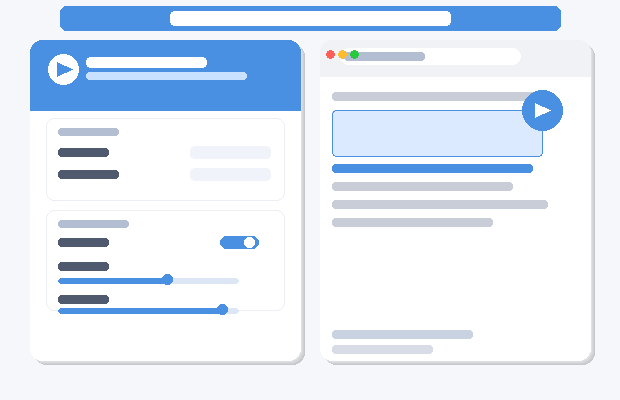

# 🔊 Web Sesli Okuyucu

> Chrome/Edge için Türkçe metin okuma eklentisi. Herhangi bir web sayfasında metin seçince otomatik olarak ses butonu çıkar, tıklayınca Google TTS ile sesli okur.



---

## ✨ Özellikler

- **Otomatik buton** — Metin seçince sağ tarafa ▶ butonu çıkar, ekstra adım yok
- **Google TTS** — Google Translate altyapısıyla yüksek kaliteli ses sentezi
- **Türkçe desteği** — ş, ğ, ü, ö, ç, ı karakterlerini doğru okur
- **Uzun metin** — Metin otomatik parçalanır, kesintisiz oynatılır
- **Ayar paneli** — Hız, ses seviyesi, sunucu seçimi
- **Esc ile durdur** — Klavyeden anında durdurma
- **Shadow DOM** — Sayfa tasarımını bozmaz

---

## 📦 Kurulum

Chrome Web Store'da yayınlanmamıştır. Manuel kurulum gerekir (2 dakika):

### Chrome / Edge

1. Bu repoyu ZIP olarak indirin → **Code → Download ZIP**
2. ZIP'i bir klasöre çıkartın
3. Tarayıcınızda `chrome://extensions` adresini açın
4. Sağ üstteki **"Geliştirici modu"** anahtarını açın
5. **"Paketlenmemiş uzantı yükle"** butonuna tıklayın
6. ZIP'i çıkarttığınız klasörü seçin
7. ✅ Hazır!

---

## 🎯 Kullanım

1. Herhangi bir web sayfasında metni fare ile seçin
2. Seçimin yanında beliren **▶** butonuna tıklayın
3. Okuma başlar — **■** butonuyla veya **Esc** tuşuyla durdurun
4. Tarayıcı araç çubuğundaki eklenti simgesinden ayarları değiştirin

---

## ⚙️ Ayarlar

| Ayar | Açıklama |
|------|----------|
| **Dil** | Otomatik tespit veya manuel seçim (13 dil) |
| **Sunucu** | `translate.google.com` / `.com.hk` / `.com.tr` |
| **Yavaş Mod** | Daha yavaş ve net okuma |
| **Okuma Hızı** | 0.5× — 2.0× arası |
| **Ses Seviyesi** | %0 — %100 arası |

---

## 📁 Proje Yapısı

```
├── manifest.json          # Uzantı yapılandırması (MV3)
├── icons/                 # Uzantı ikonları
└── src/
    ├── background.js      # Google TTS API isteği ve MP3 indirme
    ├── content-script.js  # Metin seçimi, yüzen buton, ses çalma
    ├── popup.html         # Ayar paneli arayüzü
    └── popup.js           # Ayarların kaydedilmesi
```

---

## 🔒 İzinler

| İzin | Neden |
|------|-------|
| `activeTab` | Mevcut sayfada içerik scripti çalıştırmak için |
| `storage` | Dil/hız/ses ayarlarını kaydetmek için |
| `translate.google.com` | Ses sentezi API'sine erişmek için |

---

## ⚠️ Notlar

- İnternet bağlantısı gereklidir (Google TTS online servis)
- Tarayıcının yerleşik sayfalarında (`chrome://`) çalışmaz
- Google TTS ücretsiz ama resmi API değildir, kesintiler yaşanabilir

---

## 📄 Lisans

MIT License — dilediğiniz gibi kullanabilir ve geliştirebilirsiniz.
